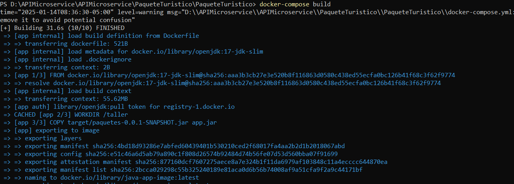

# Proyecto Paquete Turístico

Este proyecto consiste en un sistema de gestión de paquetes turísticos desarrollado en Java con Spring Boot y dockerizado para facilitar su despliegue. Incluye la conexión a una base de datos externa que ya debe estar configurada como requisito previo.

## Especificaciones Técnicas

- **Framework**: Spring Boot
- **Base de Datos**: MySQL (debe estar previamente configurada con la base de datos `taller2025`)
- **Docker**: Docker Compose para la orquestación
- **Puerto por defecto del servicio**: `8003`

---

## Requisitos Previos

1. **Base de Datos**: La base de datos `taller2025` debe estar creada y en funcionamiento. Asegúrate de que el servicio esté accesible desde el contenedor.
   
2. **Configuración de Credenciales**: Modifica las credenciales de conexión a la base de datos en el archivo `src/main/resources/application.properties` para que correspondan a tu entorno. Ejemplo:

```properties
spring.datasource.url=jdbc:mysql://<IP_BASE_DE_DATOS>:<PUERTO>/<NOMBRE_BASE_DE_DATOS>
spring.datasource.username=<USUARIO>
spring.datasource.password=<CONTRASEÑA>
```

---

## Instrucciones de Ejecución

### Paso 1: Configuración del Docker Compose


Este proyecto utiliza `docker-compose` para gestionar los contenedores. El archivo `docker-compose.yml` ya incluye las configuraciones necesarias para levantar la aplicación.

### Paso 2: Construcción de las Imágenes

Antes de levantar los servicios, asegúrate de construir las imágenes del contenedor ejecutando:

```bash
docker-compose build
```

Esto garantizará que las imágenes estén actualizadas y listas para ejecutarse.

### Paso 3: Ejecutar el Servicio

1. Abre una terminal en la carpeta raíz del proyecto.
2. Ejecuta el siguiente comando:

```bash
docker-compose up
```

Esto levantará el contenedor de la aplicación y lo conectará a la base de datos especificada.

### Paso 4: Verificar la Ejecución

1. Abre un navegador web.
2. Usa la dirección `http://localhost:8080/api/paquetes` para probar el endpoint de listado de paquetes turísticos con *POSTMAN* por ejemplo.

---

## Capturas de Pantalla

A continuación, puedes agregar imágenes del proceso de ejecución:

1. **Inicio de Docker Compose:**
   
   

2. **Conexión Exitosa a la Base de Datos:**
   

3. **Prueba de Endpoint:**
   
   
   
   

---

## Notas Adicionales

- Asegúrate de que los puertos utilizados en el archivo `docker-compose.yml` no estén en conflicto con otros servicios en tu máquina.
- Si necesitas modificar algún parámetro de ejecución, puedes editar el archivo `docker-compose.yml` directamente.
- Usa `docker-compose down` para detener y eliminar los contenedores creados.

